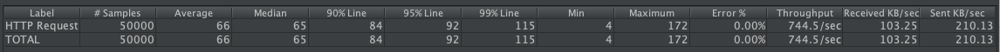
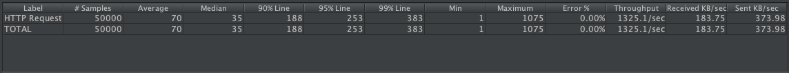

# kafka-producer


# helm chart command to deploy cassandra

# helm chart command to deploy kafka
helm upgrade --install kafka --namespace kafka incubator/kafka

# Commands
Open the container in vscode remote container and run `go build`

To launch the server, use `./kafka-producer <broker> <topic>`

To publish, perform
```
curl --request POST 'http://localhost:8100/produce' \
--header 'Content-Type: application/json' \
--data-raw '{
    "message": "data"
}'
```

# Simple comparison
On local laptop, running 50000 iterations

No goroutine, 50 connections


With goroutine, 50 connections


With goroutine, 100 connections
